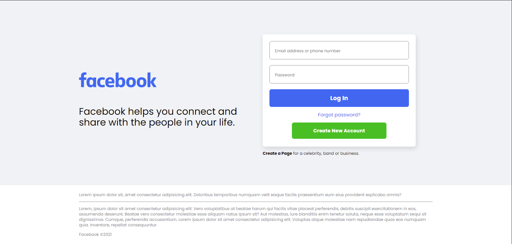

# facebook-homepage-clone

A fun side project to test my CSS skills

## Screenshot

### Links

- Solution URL: [Repository](https://github.com/pHoeniX-svg/facebook-homepage-clone)
- Live Site URL: [Live URL](https://phoenix-svg.github.io/facebook-homepage-clone)

### Built with

- Semantic HTML5 markup
- CSS custom properties
- Flexbox
- Desktop-first workflow
